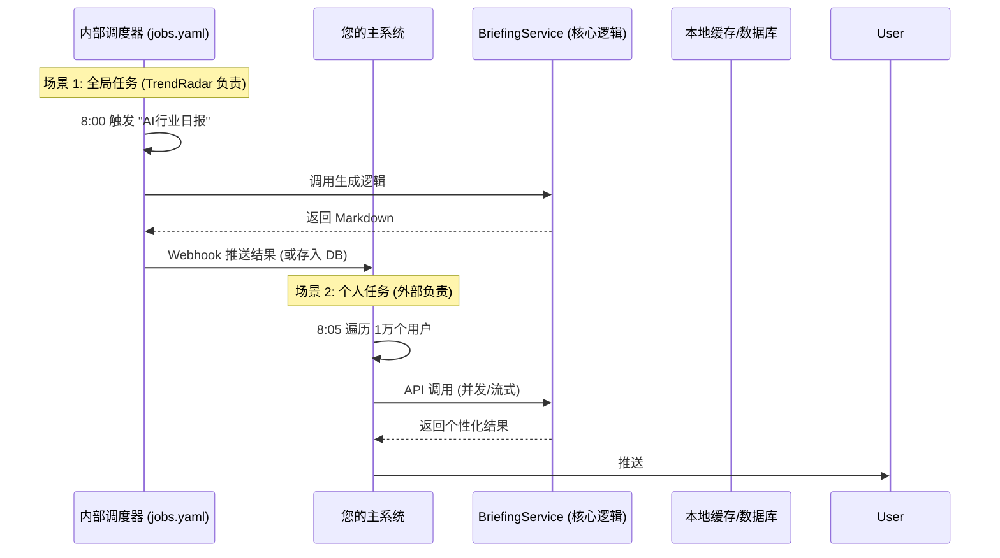

# TrendRadar Briefing Server (Decoupled Service)

## 核心理念

**TrendRadar 作为无状态计算服务**。
它不存储任何用户配置，也不负责调度。
所有的定时任务（无论是公共的还是个人的）都由外部系统或 TrendRadar 主程序的 `timeline` 机制触发。

## 架构流程图 (包含调度分工)

## 调度分工策略

### 1. 全局任务 (TrendRadar 负责)

- **定义**: 通用的、不随用户变化的简报（如“科技热点”、“财经早报”）。
- **实现**: 复用 TrendRadar 主程序的 `timeline.yaml` 机制，按时调用 Briefing API 或内部逻辑。
- **配置**: 无需在 `briefing_server` 中单独配置 `jobs.yaml`。

### 2. 个人任务 (外部系统负责)

- **定义**: 千人千面的定制简报。
- **逻辑**: 保持**无状态**。TrendRadar 不知道 UserA 的存在，只响应 API 请求。

## 数据源定制策略

- **筛选标准源**：API 接收 `allowed_sources` 参数（极速）。
- **自定义 RSS**：API 接收 `custom_rss_urls` 参数（实时抓取）。

## AI 生成优化 (流式响应)

采用 **Server-Sent Events (SSE)** 实现打字机效果。

## API 接口设计

### 生成简报接口

- **URL**: `POST /api/v1/briefing/stream`

## 核心代码变更点 (No Core Modifications)

### 1. `briefing_server/utils.py` (新增)

独立实现 `parse_frequency_rules` 逻辑，避免修改 TrendRadar 核心代码。

### 2. `briefing_server/service.py` (新增)

独立实现 `BriefingService`，内部包含 Prompt 构建逻辑，避免修改 `AIAnalyzer`。

### 3. `briefing_server/scheduler.py` (已移除)

~~读取 `briefing_server/config/jobs.yaml`，使用 `APScheduler` 运行定时任务。~~ (已移除，改用 Timeline)

### 4. `briefing_server/main.py` (纯 API)

仅启动 API 服务，不再启动内部调度器。

## 方案优势

1.  **职责清晰**: 公共的归公（TrendRadar），私人的归私（外部系统）。
2.  **开箱即用**: 不需要外部系统为此写专门的定时脚本来跑“科技日报”。
